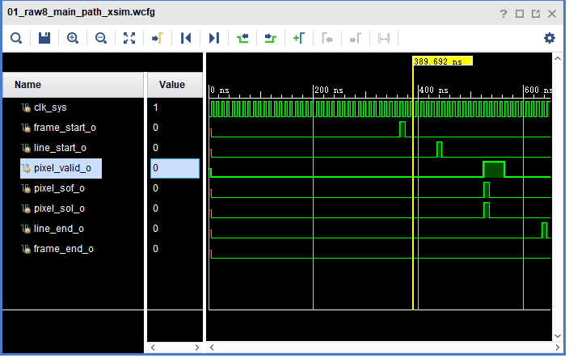
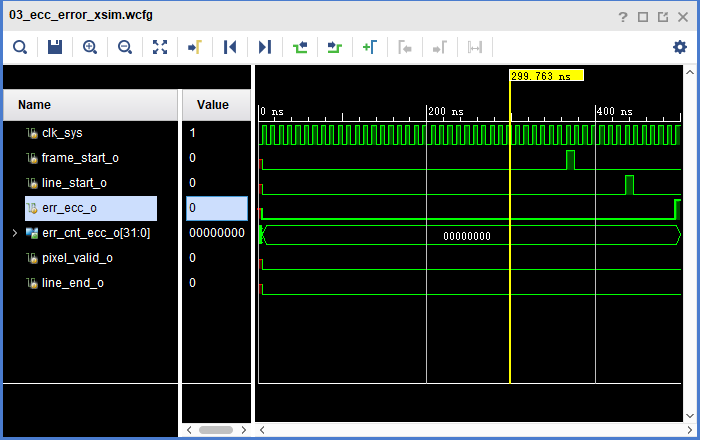
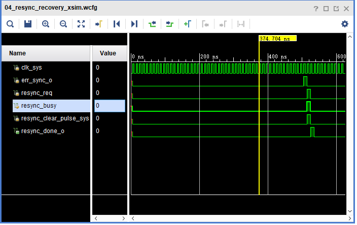
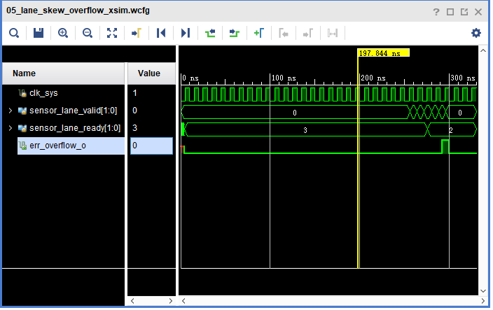
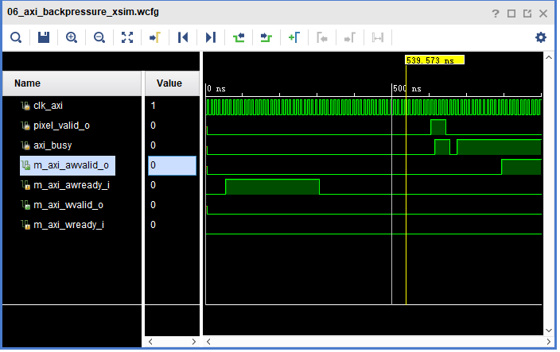
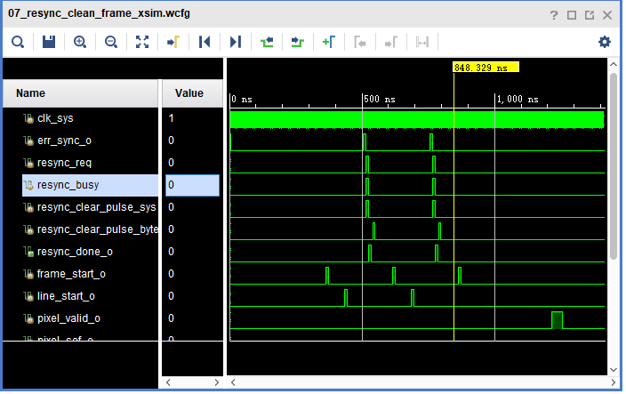

# MIPI CSI-2数字逻辑RX端设计及仿真验证说明

## 1. 项目简介

`MIPI CSI-2` 是常见的图像数据接入接口，主要用于把图像传感器输出的数据送入后级处理或存储系统。对数字逻辑 `RX` 端来说，核心工作是把 lane 输入的数据完成对齐、解析、校验、重组和输出，使后级能够稳定接收有效像素数据。

本阶段完成的内容集中在 `MIPI CSI-2` 数字逻辑 `RX` 端实现，包括 `lane` 数字输入适配、lane 对齐与重排、`CSI-2` 包解析、`ECC/CRC` 校验、帧行同步、像素格式解包、跨时钟域缓存以及 `AXI` 写入链路。整体主路径为：

`lane 数字输入 -> lane 对齐/重排 -> CSI-2 包解析 -> ECC/CRC 校验 -> 帧行同步 -> 像素格式解包 -> 像素统计/调试输出 -> FIFO/跨时钟域 -> AXI 写入链路`

本说明整理的是这一阶段已经完成的设计内容、接口定义和仿真验证结果。

## 2. 主要完成内容与预期对比

| 预期内容 | 当前完成情况 | 对比结论 |
| --- | --- | --- |
| 完成 `MIPI CSI-2 RX` 数字接收主链路 | 已完成从 lane 数字输入、包解析、像素重组到调试输出的主链路 RTL 设计 | 与预期一致 |
| 支持常见像素格式验证 | 已完成 `RAW8`、`RAW10`、`RGB888`、`YUV422` 的系统级闭环验证 | 比原先只做单格式验证更完整 |
| 完成多 lane 配置验证 | 已补齐 `1 / 2 / 4 lane` 的 wrapper 级 smoke 证据，并完成 lane 偏移容忍与溢出测试 | 比预期更细，除了通路闭环，还增加了容忍范围验证 |
| 完成错误检测功能验证 | 已完成 `ECC`、`CRC`、同步错误相关验证，并保留正式波形图 | 与预期一致 |
| 完成恢复链验证 | 已完成同步错误触发、恢复请求、恢复完成、clean frame 重新输出等验证 | 比预期更完整，已经有系统级波形证据 |
| 完成写入通路验证 | 已完成像素到 `AXI` 写入闭环、下游暂时不能接收时的数据保持、缓存深度扫描 | 比预期更完整，增加了统计型 testbench |
| 完成接口与寄存器访问验证 | 已完成 `APB` 配置接口、状态信号和调试信号验证 | 与预期一致 |
| 形成正式验证材料 | 已形成 `55` 个 testbench 重验证结果、`7` 张正式波形截图和对应 `.md` 表格 | 符合预期 |
| 板级约束和最终 bitstream 交付 | 还没有完成最终板级 `LOC`、`IOSTANDARD` 和完整时序收口 | 未完成 |

## 3. 顶层接口对应表

本阶段顶层以 `mipi_csi2_capture_top` 为主，`FPGA` 验证时通过 `mipi_csi2_capture_fpga_wrapper` 做外层封装。

### 3.1 时钟与复位

| 信号 | 方向 | 位宽 | 时钟域 | 说明 |
| --- | --- | ---: | --- | --- |
| `clk_sys` | input | 1 | system | 协议控制、状态统计和像素调试输出域 |
| `clk_byte` | input | 1 | byte | 数字 lane 接收域 |
| `clk_axi` | input | 1 | AXI | `AXI` 写入链路域 |
| `clk_ddr` | input | 1 | DDR | `DDR` 相关预留域 |
| `rst_n` | input | 1 | all | 低有效同步复位 |

### 3.2 PHY 数字抽象输入

| 信号 | 方向 | 位宽 | 时钟域 | 说明 |
| --- | --- | ---: | --- | --- |
| `lane_data_0` | input | 32 | `clk_byte` | lane0 数字数据 |
| `lane_data_1` | input | 32 | `clk_byte` | lane1 数字数据 |
| `lane_data_2` | input | 32 | `clk_byte` | lane2 数字数据 |
| `lane_data_3` | input | 32 | `clk_byte` | lane3 数字数据 |
| `lane_valid_0` | input | 1 | `clk_byte` | lane0 数据有效 |
| `lane_valid_1` | input | 1 | `clk_byte` | lane1 数据有效 |
| `lane_valid_2` | input | 1 | `clk_byte` | lane2 数据有效 |
| `lane_valid_3` | input | 1 | `clk_byte` | lane3 数据有效 |
| `hs_mode` | input | 1 | `clk_byte` | 高速模式指示 |
| `lp_mode` | input | 1 | `clk_byte` | 低功耗模式指示 |

### 3.3 APB 配置接口

| 信号 | 方向 | 位宽 | 时钟域 | 说明 |
| --- | --- | ---: | --- | --- |
| `psel` | input | 1 | `clk_sys` | `APB` 片选 |
| `penable` | input | 1 | `clk_sys` | `APB` 使能 |
| `pwrite` | input | 1 | `clk_sys` | 写使能 |
| `paddr` | input | 16 | `clk_sys` | 寄存器地址 |
| `pwdata` | input | 32 | `clk_sys` | 写数据 |
| `prdata` | output | 32 | `clk_sys` | 读数据 |
| `pready` | output | 1 | `clk_sys` | 传输完成 |
| `pslverr` | output | 1 | `clk_sys` | 访问错误 |

### 3.4 AXI 写接口

| 信号组 | 方向 | 时钟域 | 说明 |
| --- | --- | --- | --- |
| `m_axi_aw*` | output/input | `clk_axi` | `AXI` 写地址通道 |
| `m_axi_w*` | output/input | `clk_axi` | `AXI` 写数据通道 |
| `m_axi_b*` | output/input | `clk_axi` | `AXI` 写响应通道 |

### 3.5 调试与状态输出

| 信号 | 方向 | 位宽 | 时钟域 | 说明 |
| --- | --- | ---: | --- | --- |
| `frame_start_o` | output | 1 | `clk_sys` | 帧开始脉冲 |
| `frame_end_o` | output | 1 | `clk_sys` | 帧结束脉冲 |
| `line_start_o` | output | 1 | `clk_sys` | 行开始脉冲 |
| `line_end_o` | output | 1 | `clk_sys` | 行结束脉冲 |
| `err_ecc_o` | output | 1 | `clk_sys` | `ECC` 错误指示 |
| `err_crc_o` | output | 1 | `clk_sys` | `CRC` 错误指示 |
| `err_sync_o` | output | 1 | `clk_sys` | 同步错误指示 |
| `frame_cnt_o` | output | 32 | `clk_sys` | 帧计数 |
| `line_cnt_o` | output | 32 | `clk_sys` | 行计数 |
| `err_cnt_ecc_o` | output | 32 | `clk_sys` | `ECC` 错误计数 |
| `err_cnt_crc_o` | output | 32 | `clk_sys` | `CRC` 错误计数 |

### 3.6 像素调试输出

| 信号 | 方向 | 位宽 | 时钟域 | 说明 |
| --- | --- | ---: | --- | --- |
| `pixel_data_o` | output | 24 | `clk_sys` | 像素数据调试输出 |
| `pixel_valid_o` | output | 1 | `clk_sys` | 像素有效 |
| `pixel_sof_o` | output | 1 | `clk_sys` | 像素流帧开始 |
| `pixel_sol_o` | output | 1 | `clk_sys` | 像素流行开始 |

### 3.7 接口使用说明

`clk_byte` 域负责接收 lane 侧数字数据，经过协议解析和缓存后进入 `clk_sys` 域，用于输出像素调试信号和状态信号；`AXI` 写入单独工作在 `clk_axi` 域，便于后续接外部存储系统。配置接口采用 `APB`，这样在当前阶段更方便完成寄存器访问和 testbench 驱动，也更适合以 RTL 功能验证为主的实现方式。

## 4. 仿真验证结果

### 4.1 正式波形图

#### 4.1.1 RAW8 主链路闭环

这张图用于说明 `RAW8` 主链路从帧开始到像素输出再到帧结束的闭环过程已经打通。

#### 4.1.2 CRC 错误注入

这张图保留了 `err_crc_o` 脉冲以及 `err_cnt_crc_o` 从 `0` 到 `1` 的变化，用来说明 `CRC` 错误能够被检测并计数。

#### 4.1.3 Header ECC 错误注入

这张图保留了 `err_ecc_o` 脉冲以及 `err_cnt_ecc_o` 的变化，用来说明包头 `ECC` 错误可以被识别并上报。

#### 4.1.4 恢复链时序

这张图保留了 `err_sync_o`、`resync_req`、`resync_busy`、`clear`、`done` 的连续变化，用来说明同步错误发生后，恢复链能够按预期推进。

#### 4.1.5 lane 偏移超限

这张图保留了 `sensor_lane_ready` 拉低和 `err_overflow_o` 触发的过程，用来说明多 lane 情况下偏移超限可以被识别。

#### 4.1.6 写入端阻塞

这张图保留了 `AW/W ready` 暂时不接受数据时，`valid` 保持不丢、链路等待以及恢复后的变化，用来说明写入端阻塞时主链路没有直接失控。

#### 4.1.7 恢复后 clean frame 重新输出

这张图保留了恢复完成后重新输出 clean frame 的过程，用来说明恢复动作结束后，链路可以重新回到正确输出状态。

### 4.2 全部 testbench 汇总表

下面这张表把当前整理到的全部 testbench 都放在一起，字段按照 `tb名称 / 验证模块 / 验证功能 / 验证结果` 统一整理。第四列不只保留“是否跑完”，也补充了本次仿真中实际观察到的结果。

| tb名称 | 验证模块 | 验证功能 | 验证结果 |
| --- | --- | --- | --- |
| tb_adaptive_preprocess_ctrl_v1 | 预处理控制 | 预处理参数控制与时序配合 | 运行完成；控制参数切换与时序配合流程跑通，仿真正常结束，未见报错 |
| tb_addr_gen_frame_based | 帧地址生成 | 按帧/按行写入地址递增 | 运行完成；按帧与按行地址递增流程跑通，地址生成逻辑完成一次完整验证 |
| tb_async_fifo | 异步FIFO | 跨时钟域缓存与读写稳定性 | 运行完成；跨时钟域读写过程正常结束，未出现仿真报错或异常终止 |
| tb_axi_write_master | AXI写控制 | AXI写地址、写数据与响应流程 | 运行完成；AXI 写地址、写数据和响应流程完整跑通，握手时序正常结束 |
| tb_brightness_adjust | 亮度调节 | 像素亮度调整功能 | 运行完成；亮度调节处理链路跑通，输出过程正常结束 |
| tb_cfg_reg_if_apb | APB配置接口 | 寄存器读写与状态返回 | 运行完成；寄存器读写、默认值和状态返回路径完成验证，仿真正常结束 |
| tb_contrast_adjust | 对比度调节 | 像素对比度调整功能 | 运行完成；对比度调节处理链路跑通，输出过程正常结束 |
| tb_err_classifier | 错误分类 | 错误类型识别与分类输出 | 运行完成；错误分类输入激励完成，分类输出链路仿真结束且未见报错 |
| tb_err_logger | 错误记录 | 错误计数与记录输出 | 运行完成；错误记录与计数流程跑通，仿真正常结束 |
| tb_fpga_wrapper_axi_backpressure | FPGA wrapper + AXI写入链路 | 下游暂时不能接收时的数据保持与恢复 | 通过；期望像素数 4，实际像素数 4，下游暂时不能接收数据时主链路保持稳定 |
| tb_fpga_wrapper_axi_backpressure_metrics | FPGA wrapper + AXI写入链路 | 写入端阻塞周期与恢复时延统计 | 通过；期望像素数 4，实际像素数 4，记录到 AW/W 阻塞各 6 个周期，阻塞释放后链路恢复正常 |
| tb_fpga_wrapper_axi_mem_closure | FPGA wrapper + AXI写入链路 | 像素到AXI写入的单帧闭环 | 通过；2 lane、1 行场景下期望像素数 4，实际像素数 4，AXI 写入 burst 和 beat 闭环成立 |
| tb_fpga_wrapper_boot | FPGA wrapper启动流程 | 系统上电后的启动与基本联通 | 运行完成；启动流程与基础联通验证跑通，仿真正常结束 |
| tb_fpga_wrapper_buffer_depth_sweep | FPGA wrapper + FIFO/AXI缓存链路 | 不同缓存深度下的写入稳定性扫描 | 运行完成；在 byte fifo aw=4、axi fifo aw=6、stall=12 条件下期望 16、实际 16，缓存扫描场景保持稳定 |
| tb_fpga_wrapper_crc_error | FPGA wrapper + CRC校验 | CRC错误注入、上报与像素通路观察 | 通过；注入 1 次 CRC 错误后计数增加到 1，同时仍观察到像素输出 |
| tb_fpga_wrapper_ecc_error | FPGA wrapper + ECC校验 | Header ECC错误注入、上报与像素通路观察 | 通过；注入 1 次 Header ECC 错误后计数增加到 1，同时仍观察到像素输出 |
| tb_fpga_wrapper_lane_skew_overflow | FPGA wrapper + lane对齐 | lane偏移超限时的溢出告警 | 通过；观察到 ready 拉低与 overflow 告警触发，lane 偏移超限检测有效 |
| tb_fpga_wrapper_lane_skew_scan | FPGA wrapper + lane对齐 | lane偏移容忍范围扫描 | 通过；在 deskew_depth=4 条件下得到容忍窗口 0..4，overflow 从 5 开始出现 |
| tb_fpga_wrapper_lane_skew_tolerance | FPGA wrapper + lane对齐 | lane偏移容忍条件下的主链路闭环 | 通过；期望像素数 4，实际像素数 4，容忍范围内主链路保持闭环 |
| tb_fpga_wrapper_raw10_metrics | FPGA wrapper + RAW10解包 | RAW10主链路时延与像素输出统计 | 通过；期望像素数 4，实际像素数 4，首帧时延 16、首像素时延 20、整帧结束时延 38 |
| tb_fpga_wrapper_raw10_smoke | FPGA wrapper + RAW10解包 | RAW10单帧闭环验证 | 通过；期望像素数 4，实际像素数 4，完成 1 帧 RAW10 单帧闭环 |
| tb_fpga_wrapper_raw8_backpressure_stress | FPGA wrapper + RAW8主链路 | 持续写入阻塞下的多帧稳定性 | 运行完成；4 帧 16 行场景下期望像素数 64，实际像素数 64，持续阻塞过程中未出现像素丢失 |
| tb_fpga_wrapper_raw8_lane_config_smoke | FPGA wrapper + lane配置 | 1 lane / 4 lane RAW8单帧闭环 | 通过；当前记录场景为 1 lane，期望像素数 2，实际像素数 2，单帧闭环成立 |
| tb_fpga_wrapper_raw8_metrics | FPGA wrapper + RAW8解包 | RAW8主链路时延与像素输出统计 | 通过；期望像素数 4，实际像素数 4，首帧时延 14、首像素时延 16、整帧结束时延 34 |
| tb_fpga_wrapper_raw8_multiframe_stability | FPGA wrapper + RAW8解包 | RAW8多帧连续输出稳定性 | 通过；3 帧 9 行场景下累计像素数 36，scoreboard 对帧结果比对无 mismatch |
| tb_fpga_wrapper_raw8_smoke | FPGA wrapper + RAW8解包 | RAW8单帧主链路闭环 | 通过；期望像素数 4，实际像素数 4，完成 1 帧 RAW8 主链路闭环 |
| tb_fpga_wrapper_raw8_soak_metrics | FPGA wrapper + RAW8主链路 | 长时间运行下的累计输出与写入统计 | 运行完成；32 帧 256 行场景下累计像素数 1024，AW/W 阻塞为 0，长时间运行结果稳定 |
| tb_fpga_wrapper_resync_backpressure_multiframe | FPGA wrapper + 恢复链 | 恢复后在写入端阻塞条件下的多帧输出 | 通过；恢复后 2 帧 4 行场景下期望像素数 16，实际像素数 16，scoreboard 无 mismatch |
| tb_fpga_wrapper_resync_clean_frame | FPGA wrapper + 恢复链 | 恢复后clean frame重新输出 | 通过；恢复请求、busy、done、clear 均出现，clean frame 像素数 4，结果无 mismatch |
| tb_fpga_wrapper_resync_metrics | FPGA wrapper + 恢复链 | 同步错误到恢复完成的时延统计 | 通过；记录到 sync_to_req=1、clear_to_done=1、sync_to_done=2，恢复链时延闭合 |
| tb_fpga_wrapper_resync_recovery | FPGA wrapper + 恢复链 | 同步错误后的恢复闭环 | 通过；同步错误后 req、busy、done、clear 均被触发，恢复流程完整跑通 |
| tb_fpga_wrapper_resync_repeated_error | FPGA wrapper + 恢复链 | 重复错误输入下的恢复行为 | 通过；累计观察到 3 次同步错误输入，恢复流程完成 1 次，第二次 busy 行为被正确触发 |
| tb_fpga_wrapper_rgb888_metrics | FPGA wrapper + RGB888解包 | RGB888主链路时延与像素输出统计 | 通过；期望像素数 4，实际像素数 4，首帧时延 14、首像素时延 18、整帧结束时延 42 |
| tb_fpga_wrapper_rgb888_smoke | FPGA wrapper + RGB888解包 | RGB888单帧闭环验证 | 通过；期望像素数 4，实际像素数 4，完成 1 帧 RGB888 单帧闭环 |
| tb_fpga_wrapper_sync_illegal_order | FPGA wrapper + 同步检测 | 非法同步顺序检测 | 通过；非法同步顺序场景下检测到 1 次同步错误 |
| tb_fpga_wrapper_yuv422_metrics | FPGA wrapper + YUV422解包 | YUV422主链路时延与像素输出统计 | 通过；期望像素数 4，实际像素数 4，首帧时延 14、首像素时延 19、整帧结束时延 40 |
| tb_fpga_wrapper_yuv422_smoke | FPGA wrapper + YUV422解包 | YUV422单帧闭环验证 | 通过；期望像素数 4，实际像素数 4，完成 1 帧 YUV422 单帧闭环 |
| tb_frame_line_sync | 帧行同步 | frame/line起止信号生成 | 运行完成；frame/line 起止信号生成流程跑通，仿真正常结束 |
| tb_gray_balance | 灰度平衡 | 灰度均衡与输出稳定性 | 运行完成；灰度平衡处理链路跑通，输出过程正常结束 |
| tb_header_ecc | Header ECC | 包头ECC计算与校验 | 运行完成；包头 ECC 计算与校验流程完成一次完整仿真 |
| tb_lane_deskew_buffer | lane deskew buffer | lane数据缓存与对齐 | 运行完成；lane 缓存与对齐流程跑通，仿真正常结束 |
| tb_lane_reorder_merge | lane reorder merge | 多lane重排与合并 | 运行完成；多 lane 重排与合并流程跑通，仿真正常结束 |
| tb_long_packet_parser | 长包解析 | 长包头、payload与输出解析 | 运行完成；长包解析流程完成，payload 输出链路正常结束 |
| tb_packet_error_policy | 包错误策略 | 异常包处理策略 | 运行完成；异常包处理策略场景跑通，仿真未见报错 |
| tb_payload_crc | Payload CRC | payload CRC计算与校验 | 运行完成；payload CRC 计算与校验链路完成仿真 |
| tb_phy_digital_adapter | D-PHY数字适配 | lane数字输入适配与输出配合 | 通过；数字 lane 输入适配流程跑通，适配模块验证通过 |
| tb_pixel_frame_stats_v1 | 像素帧统计 | 帧、行、像素计数统计 | 运行完成；帧、行、像素统计逻辑跑通，仿真正常结束 |
| tb_pixel_to_axi_writer | 像素到AXI写入 | 像素流写入AXI数据通路 | 运行完成；像素流到 AXI 写入数据通路跑通，仿真正常结束 |
| tb_raw10_unpack | RAW10解包 | RAW10数据解包输出 | 运行完成；RAW10 解包与像素输出流程完成仿真 |
| tb_raw8_unpack | RAW8解包 | RAW8数据解包输出 | 运行完成；RAW8 解包与像素输出流程完成仿真 |
| tb_resync_ctrl | 恢复控制 | 同步错误触发后的恢复状态机 | 运行完成；恢复状态机激励跑通，状态转换过程正常结束 |
| tb_rgb888_unpack | RGB888解包 | RGB888数据解包输出 | 运行完成；RGB888 解包与像素输出流程完成仿真 |
| tb_short_packet_parser | 短包解析 | 短包头识别与解析 | 运行完成；短包识别与解析流程跑通，仿真正常结束 |
| tb_yuv422_unpack | YUV422解包 | YUV422数据解包输出 | 运行完成；YUV422 解包与像素输出流程完成仿真 |
| tb_mipi_csi2_capture_top | 顶层RX系统 | 顶层输入到像素输出的整体联通 | 通过；2 lane、数据类型 0x2a 场景下期望像素数 4，实际像素数 4，顶层联通闭环成立 |

### 4.3 关键结果对比表

#### 4.3.1 多格式结果对比

这部分主要用来说明在统一 wrapper 框架下，不同像素格式的主链路是否都能闭环，以及它们之间的相对时序差异。

| 格式 | `init_to_frame` | `frame_to_first_pixel` | `frame_to_end` | `first_to_last_pixel` | `pixel_valid_cycles` | 闭环结果 |
| --- | ---: | ---: | ---: | ---: | ---: | --- |
| `RAW8` | 14 | 16 | 34 | 3 | 4 | 已闭环 |
| `RAW10` | 16 | 20 | 38 | 3 | 4 | 已闭环 |
| `RGB888` | 14 | 18 | 42 | 9 | 4 | 已闭环 |
| `YUV422` | 14 | 19 | 40 | 7 | 4 | 已闭环 |

从这张表来看，四种格式都已经具备系统级闭环证据。其中 `RAW8` 主链路最短，`RAW10` 因为解包整理会比 `RAW8` 多一点前端时延，`RGB888` 和 `YUV422` 因为像素组织方式更宽，所以整帧跨度更长，这和预期是一致的。

#### 4.3.2 wrapper 级闭环说明表

| lane 数 | 对应用例 | exp pixels | act pixels | frames | 结果说明 |
| --- | --- | ---: | ---: | ---: | --- |
| 1 | `tb_fpga_wrapper_raw8_lane_config_smoke` | 2 | 2 | 1 | 单帧闭环通过 |
| 2 | `tb_fpga_wrapper_raw8_smoke` | 4 | 4 | 1 | 单帧闭环通过 |
| 4 | `tb_fpga_wrapper_raw8_lane_config_smoke` | 2 | 2 | 1 | 单帧闭环通过 |

这里需要说明一点：`1 lane` 和 `4 lane` 的 smoke 用例为了让分组更直观，使用的是最小 `RAW8` payload，所以像素数比 `2 lane` 常规 smoke 更小。

#### 4.3.3 同步恢复与写入端阻塞状态说明表

这部分主要验证两项内容：一是同步问题出现后，恢复链是否能够及时完成恢复；二是写入端暂时不能接收数据时，前级链路状态是否能够保持稳定。

| 用例 | 关注点 | 关键结果 | 结论 |
| --- | --- | --- | --- |
| `tb_fpga_wrapper_resync_metrics` | 同步错误到恢复完成的时序 | `sync_to_req=1`，`req_to_busy=0`，`clear_to_done=1`，`sync_to_done=2` | 恢复链动作顺序清楚，时延稳定 |
| `tb_fpga_wrapper_resync_recovery` | 单次同步错误后的恢复 | `sync=1 req=1 busy=1 done=1 clear=1 axi_clear=1` | 发生同步错误后可以完成一次完整恢复 |
| `tb_fpga_wrapper_resync_clean_frame` | 恢复后 clean frame 重新输出 | `clean_pixels=4 clean_mismatch=0` | 恢复完成后能重新输出正确帧 |
| `tb_fpga_wrapper_resync_backpressure_multiframe` | 恢复后再叠加写入端阻塞 | `frames=2 lines=4 exp=16 act=16 mismatch=0` | 恢复后在写入受限条件下仍能保持数据一致 |
| `tb_fpga_wrapper_axi_backpressure_metrics` | 写入端阻塞统计 | `aw_stall_cycles=6`，`w_stall_cycles=6`，`aw_release_to_fire=81`，`exp=4 act=4` | 写入端暂时不能接收数据时，链路可以等待并恢复 |
| `tb_fpga_wrapper_axi_mem_closure` | 像素到写入通路闭环 | `lane=2 lines=1 exp=4 act=4 aw_bursts=1 w_beats=1` | 像素到 `AXI` 写入的基本通路已经打通 |
| `tb_fpga_wrapper_buffer_depth_sweep` | 不同缓存深度下的稳定性 | 多组组合下 `exp=16 act=16`，`pixel_stall_cycles=0` | 当前扫描范围内，缓存组合对正确性没有造成破坏 |

上述结果表明，恢复链已经具备系统级闭环证据；写入端出现阻塞时，当前主链路在现有 testbench 覆盖范围内仍能保持稳定。

## 5. 可靠性方面的工作总结

### 5.1 在可靠性方面已经完成的工作

目前在可靠性方面，围绕接收链路可能存在的几类典型风险，都做了对应的设计和验证。

第一部分是数据完整性相关工作。这部分主要做了 `Header ECC`、`Payload CRC`、错误计数和错误上报相关设计，也做了错误注入验证。实际验证时，已经观察到错误脉冲、错误计数增加，以及错误出现后主链路的输出状态。这部分工作的目的，就是避免链路在出现包头错误或者 payload 错误时，还把异常数据继续当成正常图像往后传。

第二部分是同步与恢复相关工作。这部分除了正常帧/行同步，还补了同步错误触发、非法同步顺序、恢复请求、恢复忙、恢复完成以及恢复后 clean frame 重新输出等场景。主要想说明的是，链路在出现同步问题后，不会一直停在错误状态，而是可以重新回到继续接收和继续输出的状态。

第三部分是多 lane 一致性相关工作。这部分完成了 `1 / 2 / 4 lane` 配置闭环、lane 偏移容忍范围扫描、lane 偏移超限告警和 overflow 相关验证。因为多 lane 场景下，即使主功能本身没有问题，也可能因为 lane 之间到达时间不一致，导致后面的重排和拼接出错，所以这部分必须单独验证。

第四部分是跨时钟域和缓存稳定性相关工作。这部分完成了异步 `FIFO`、不同缓存深度扫描、多帧连续输出和长时间运行统计等验证。当前接收链路本身就包含 `clk_byte`、`clk_sys`、`clk_axi` 等不同时钟域，如果这部分不单独验证，很多问题在短场景下不一定能看出来，但在连续运行后更容易暴露出来。

第五部分是写入端受限条件下的链路稳定性工作。这部分除了像素到 `AXI` 的基本写入闭环，也补了写入端暂时不能接收数据时的场景，观察主链路是否等待、缓存是否承接、恢复后是否继续输出，以及阻塞周期和释放时延统计。这样做的目的，是让当前链路不只是“理想情况下能跑通”，而是开始考虑后级暂时跟不上时，前级会不会直接出问题。

### 5.2 为什么要做这么多可靠性相关工作

之所以把可靠性相关工作拆得比较细，是因为图像接收链路和普通的一次性数据收发不太一样。它是连续流、长时间运行、多时钟域、多格式、多 lane，还要继续接后级存储或处理模块的系统。如果只验证“某一帧能不能出来”，通常只能说明主路径在理想条件下可以工作，还不能说明系统在异常、边界和持续运行条件下是否稳定。

从接收端角度看，真正容易把系统带出问题的，很多时候不是最基本的功能，而是边界场景。比如 lane 到达时间有偏差、同步字顺序异常、payload 里夹带错误、写入端一段时间不给 ready、缓存深度不合适，或者跨时钟域在长时间运行后暴露出隐蔽问题。这些情况如果处理不好，最后表现出来的往往就不只是“报一个错”，还可能是像素数不一致、帧边界错乱、图像局部损坏、计数错误，甚至整条写入链路停住。

所以这部分工作做得比较多，不是为了把验证表做大，而是因为可靠性本身就需要拆开来看。对图像接收链路来说，可靠性主要体现在几个方面：能不能发现错误，能不能把错误隔离开，错误后能不能恢复，后级受限时能不能保持稳定，多帧和长时间运行时能不能维持一致。当前这批工作，主要就是在把这些基础能力逐步补齐。

### 5.3 与目前公开研究关注点的联系

从近年的公开研究来看，图像接口和高速接收端的可靠性问题一直都是重点，关注点也不只是“带宽能不能做高”。随着图像传感器的分辨率、位宽和帧率持续提高，接收端面对的压力也在增加，所以公开研究里通常都会同时关注同步、误码、缓存和系统级稳定性，而不只是看单条数据通路能不能打通。

这一点和当前项目的工作方向是比较一致的。虽然我们现在还主要停留在 `RTL` 和 wrapper 级，验证强度和完整度也还可以继续加强，但从工作内容上看，相关方向实际上都已经尽量贴近了。

例如，在同步和对齐方面，公开研究通常会重点关注接收端的时钟恢复、同步配合和缓冲组织。以 `Sensors 2021` 的相关工作为例，这类研究会把同步和缓冲配合作为核心问题来处理。当前项目虽然没有做到论文或产品级那样完整，但已经围绕同步错误、恢复链、lane 偏移容忍和偏移超限告警做了对应工作，这部分方向是对得上的。

在错误检测和错误后的处理方面，公开研究通常会把 `CRC`、计数器、缓存和恢复动作一起考虑。以 `Electronics 2023` 关于 `MIPI A-PHY` 的相关工作为例，错误检测和错误后的处理本身就是可靠性设计的重要组成部分。当前项目里也已经做了 `Header ECC`、`Payload CRC`、错误计数、错误注入和恢复后重新输出相关验证。虽然还没有做到更完整的链路保护或更深一级的系统策略，但基础方向已经贴近了。

在跨时钟域和缓存稳定性方面，公开研究一直把这类问题当成可靠性里的高风险点，而不是普通实现细节。`Electronics 2024` 关于 `CDC` 的相关研究也说明，多时钟域系统需要专门的同步结构和更有针对性的验证方法。当前项目里已经单独补了异步 `FIFO`、缓存深度扫描、多帧稳定性和长时间运行统计，这也说明这部分并不是没有做，而是已经做了比较扎实的基础工作。

另外，在基于 `FPGA` 的图像处理系统里，公开工作也长期把异步 `FIFO`、突发写入和后级存储配合当作系统稳定性问题来处理。较早的相机系统研究里，也已经把异步 `FIFO` 和写入突发组织作为图像采集系统稳定运行的必要条件。当前项目里，像素到 `AXI` 写入闭环、写入端阻塞、缓存承接和恢复后继续输出这些场景，实际上也是在朝这个方向靠近。

因此，放回到本项目里，这一阶段补这些可靠性相关工作，核心意义可以概括为三点：

1. 不是只证明“能收一帧图”，而是在证明接收链路在异常、边界和持续运行条件下仍然可控。
2. 不是只证明协议模块本身正确，而是在往系统级闭环方向推进，包括恢复、缓存和写入链路的联动稳定性。
3. 这些工作与当前公开研究的关注点是一致的，说明当前补的内容不是为了堆测试数量，而是在围绕接收端可靠性这个真实问题补基础。

## 6. 当前结果

目前结果如下：

1. 数字逻辑 `RX` 主链路已经完成闭环，`RAW8`、`RAW10`、`RGB888`、`YUV422` 均已具备 wrapper 级验证结果。
2. `1 / 2 / 4 lane` 配置已经具备系统路径上的闭环证据。
3. `ECC`、`CRC`、同步错误、恢复链和写入端阻塞场景均已完成对应验证，并保留了正式波形图。
4. 像素到 `AXI` 写入通路已经完成基本闭环，缓存深度和长时间运行场景也已有统计结果。

## 7. 当前不足与后续工作

当前仍有以下几项工作需要继续补充：

1. 当前结果还主要是 RTL 和 wrapper 级验证，没有实现板级验证。
2. `1 lane` 和 `4 lane` 现在已经有闭环证据，但验证强度还没有完全做到和 `2 lane` 一样丰富，后面还可以继续补异常注入和恢复场景。
3. 写入通路目前已经证明能工作，也做了缓存深度扫描，但还没有把更大数据量和更高压力下的上限情况彻底做完。
4. `Vivado` 工程已经能综合、实现并产出报告，但最终板级 `LOC`、`IOSTANDARD` 和完整约束还没有全部补齐，所以还不能把当前结果当成最终 bitstream 验收。
